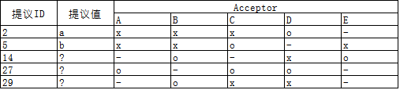
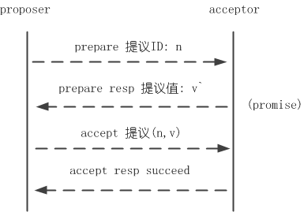
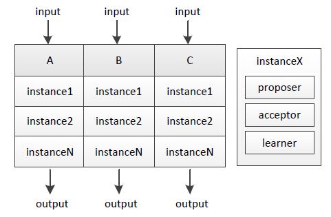

二阶段提交还是三阶段提交都无法很好的解决分布式的一致性问题，直到Paxos算法的提出，Paxos协议由**Leslie Lamport**最早在1990年提出，目前已经成为应用最广的分布式一致性算法。

Paxos协议在节点宕机恢复、消息无序或丢失、网络分化的场景下能保证决议的一致性，是被讨论最广泛的一致性协议。

Google Chubby(Zookeeper是其开源版本)的作者Mike Burrows说过这个世界上只有一种一致性算法，那就是Paxos，其它的算法都是残次品。


larmport的paxos相关的三篇论文：
1. [The Part-Time Parliament](https://lamport.azurewebsites.net/pubs/lamport-paxos.pdf)
1. [Paxos made simple](https://lamport.azurewebsites.net/pubs/paxos-simple.pdf)
1. [Fast Paxos](https://www.microsoft.com/en-us/research/publication/fast-paxos/)

## 追本溯源

1982年，Lamport与Robert Shostak、Marshall Pease共同发表了论文The Byzantine Generals Problem(拜占庭将军问题)，提出了一计算机容错理论。在理论描述过程中，为了将所要描述的问题形象的表达出来，Lamport设想出了下面这样一个场景：

> 拜占庭帝国有许多支军队，不同军队的将军之间必须制定一个统一的行动计划，从而做出进攻或者撤退的决定，同时,各个将军在地理上都是被分隔开来的，只能依靠军队的通讯员来进行通讯。然而，在所有的通讯员中可能会存在叛徒，这些叛徒可以任意篡改消息，从而达到欺骗将军的目的。

这就是著名的“拜占廷将军问题”。从理论上来说，在分布式计算领域，试图在异步系统和不可靠的通道上来达到一致性状态是不可能的，因此在对一致性的研究过程中，都往往徦设信道是可靠的。而事实上，大多数系统都是部署在同一个局域网中的，因此消息被篡改的情况非常罕见；另一方面，由于硬件和网络原因而造成的消息不完整问题，只需一套简单的校验算法即可避免----因此，在实际工程中，可以假设不存在拜占庭问题，也即假设所有消息都是完整的，没有被篡改的。那么，在这种情况下需在什么样的算法来保证一致性呢?

Lamport在1990年提出了一个理论上的一致性解决方案，同时给出了严格的数学证明。鉴于之前采用故事类比的方式成功的阐述了“拜占庭问题”，因此这次Lamport同样用心良苦地设想出了一个场景来描述这种一致性算法需在解决的问题，及其具体的解决过程：

> 在古希腊有一个叫做Paxos的小岛，岛上采用议会的形式来通过法令，议会中的议员通过信使来进行消息的传递。值得注意的是，议员和信使都是兼职的，他们随时有可能会离开议会厅，并且信使可能会重复的传递消息，也可能一去不复返，因此，议会协议要保证在这种情况下法令仍然能够正确的产生，并且不会出现冲突。

这就是论文The Part-Time Parliament中提到的兼职议会，而Paxo算法名称也是由来也是取自论文中提到的Paxos小岛。在这个论文中，Lamport压根没有说Paxos小岛是虚构出来的，而是人开展议会的方法。因此，在这个论文中，Lamport从问题的提出到算法的推演论证，通篇贯穿发对Paxos议会历史的描述。

## 理论诞生
在讨论Paxos理论之前，我们不得不首先来介绍下Paxos算法的作者Leslie Lamport(莱斯利-兰伯特)及其对计算机科学尤其是分布式计算领域的杰出贡献。作为2013年的新科图灵奖得主，现年73岁的Lamport是计算机科学领域一位拥有杰出成就的传奇人物，其先后多次荣获ACM和IEEE以及其他各类计算机重大奖项。他对时间时钟、面包店算法、拜占庭将军问题以及Paxos算法的创造性研究，极大的推动了分布式计算领域的发展，全世界无数工程师得益于他的理论。

说起Paxos理论的发表，还有一段非常有趣的历史故事。Lamport早在1990年就已经将其对Paxos算法的研究论文The Part-Time Parliament提交给ACM TOCS 的评审委员会了，但是由于Lamport创造性地使用了故事的方式来进行算法的描述，导致当时委员会的工作人员没有一个能正确理解其对算法的描述，时任主编要求其用严谨的数据证明方式来描述该算法，否则它们将不考虑接收这篇论文。遗憾的是，Lamport并没有接收它们的建议，当然也就拒绝了对论文的修改，并撤销了对这篇论文的提交。在后来的一个会议上，Lamport还对此事情耿耿于怀：“为什么这些搞理论的人一点幽默感也没有呢？”

幸运的是，还是有人能够理解Lamport那公认的令人晦涩的算法的。1996年，来自微软的Butler Lampson在WDAG96上提出了重新审视这篇分布式论文的建议，在次年的WDAG97上，麻省理工学院的Nancy Lynch也公布了其根据Lamport的原文重新修改后的Revisiting the Paxos Algorithm, “帮助”Lamport用数学的形式化术语定义并证明了Paxos算法。于是在1998年ACM TOCS上，这篇延时了9年的论文终于被接收了，也标志Paxos算法正式被计算机科学接收并开始影响更多工程师解决分布式一致性问题。

后来在2001年，Lamport本人也作出了让步，这次他放弃了故事的描述方式，而是使用了通俗易懂的语言重新讲述了原文。并发表了Paxos Made Simple -----------当然，Lamport甚为固执地任务他自己的表述语言没有歧义，并且也足够让人明白Paxos算法，因此不需在数学来协助描述，于是整篇论文还是没有任何数学符号。好在这篇文章已经能被大多数人理解。

由于Lamport个人自负固执的性格，使得Paxos理论的诞生可谓一波三折。关于Paxos理论的诞生过程，后来也成为计算机科学领域被广泛流传的学术趣事。

##   Paxos协议运行过程

Paxos 协议中，有三类节点角色

### Proposer:提案者

Proposer 可以有多个，Proposer 提出议案(value)。

所谓 value，在工程中可以是任何操作，例如“修改某个变量的值为某个值”、“设置当前 primary 为某个节点”等等。Paxos 协议中统一将这些操作抽象为 value。

不同的 Proposer 可以提出不同的甚至矛盾的 value，例如某个 Proposer 提议“将变量 X 设置为 1”，另一个 Proposer 提议“将变量 X 设置为 2”，但对同一轮 Paxos 过程，最多只有一个 value 被批准。

### Acceptor:批准者

Acceptor 有 N 个，Proposer 提出的 value 必须获得超过半数(N/2+1)的
Acceptor 批准后才能通过。

Acceptor 之间完全对等独立。

### Learner:学习者

Learner 学习被批准的 value。所谓学习就是通过读取各个 Proposer 对 value 的选择结果，如果某个 value 被超过半数 Proposer 通过，则 Learner 学习到了这个 value。

这里类似 Quorum 议会机制，某个 value 需要获得 W=N/2 + 1 的 Acceptor 批准，Learner 需要至少读取 N/2+1 个 Accpetor，至多读取 N 个 Acceptor 的结果后，能学习到一个通过的 value。

## 约束条件

上述三类角色只是逻辑上的划分，实践中一个节点可以同时充当这三类角色。有些文章会添加一个Client角色，作为产生议题者，实际不参与选举过程。

Paxos中 proposer 和 acceptor 是算法的核心角色，paxos 描述的就是在一个由多个 proposer 和多个 acceptor 构成的系统中，如何让多个 acceptor 针对 proposer 提出的多种提案达成一致的过程，而 learner 只是“学习”最终被批准的提案。

Paxos协议流程还需要满足几个约束条件：

- Acceptor必须接受它收到的第一个提案；
- 如果一个提案的v值被大多数Acceptor接受过，那后续的所有被接受的提案中也必须包含v值（v值可以理解为提案的内容，提案由一个或多个v和提案编号组成）；
- 如果某一轮 Paxos 协议批准了某个 value，则以后各轮 Paxos 只能批准这个value；

## 消息通信类型

每轮 Paxos 协议分为准备阶段和批准阶段，在这两个阶段 Proposer 和 Acceptor 有各自的处理流程。

Proposer与Acceptor之间的交互主要有4类消息通信，这4类消息对应于paxos算法的两个阶段4个过程：

#### Phase 1

1. proposer向网络内超过半数的acceptor发送prepare消息
2. acceptor正常情况下回复promise消息

#### Phase 2

1. 在有足够多acceptor回复promise消息时，proposer发送accept消息
2. 正常情况下acceptor回复accepted消息

## 确定一个议案的过程

### Phase 1 准备阶段

1. Proposer 生成全局唯一且递增的ProposalID，向 Paxos 集群的所有机器发送 Prepare请求，这里不携带value，只携带N即ProposalID 。
2. Acceptor 收到 Prepare请求 后，判断：收到的ProposalID 是否比之前已响应的所有提案的N大：

- 如果是，则：
  - (1) 在本地持久化 N，可记为Max_N。
  - (2) 回复请求，并带上已Accept的提案中N最大的value（若此时还没有已Accept的提案，则返回value为空）。
  - (3) 做出承诺：不会Accept任何小于Max_N的提案。 
- 如果否：不回复或者回复Error。

### Phase 2 选举阶段

#### P2a：Proposer 发送 Accept

经过一段时间后，Proposer 收集到一些 promise 回复消息，有下列几种情况：

1. 回复数量 > 一半的Acceptor数量，且所有的回复的value都为空，则Porposer发出accept请求，并带上自己指定的value。
2. 回复数量 > 一半的Acceptor数量，且有的回复value不为空，则Porposer发出accept请求，并带上回复中ProposalID最大的value(作为自己的提案内容)。
3. 回复数量 <= 一半的Acceptor数量，则尝试更新生成更大的ProposalID，再转P1a执行。

#### P2b：Acceptor 应答 Accept

Accpetor 收到 Accpet请求 后，判断：

1. 收到的N >= Max_N (一般情况下是 等于)，则回复提交成功，并持久化N和value。
2. 收到的N < Max_N，则不回复或者回复提交失败。

#### P2c: Proposer 统计投票

经过一段时间后，Proposer 收集到一些 Accept 回复提交成功，有几种情况：

1. 回复数量 > 一半的Acceptor数量，则表示提交value成功。此时，可以发一个广播给所有Proposer、Learner，通知它们已commit的value。
2. 回复数量 <= 一半的Acceptor数量，则 尝试 更新生成更大的 ProposalID，再转P1a执行。
3. 收到一条提交失败的回复，则尝试更新生成更大的 ProposalID，再转P1a执行。

#### 如何产生唯一的编号呢？

在《Paxos made simple》中提到的是让所有的Proposer都从不相交的数据集合中进行选择，例如系统有5个Proposer，则可为每一个Proposer分配一个标识j(0~4)，则每一个proposer每次提出决议的编号可以为5*i + j(i可以用来表示提出议案的次数)。


## Paxos协议推演

Paxos协议同时又以其“艰深晦涩”著称，下面结合 Paxos Made Simple、The Part-Time Parliament 两篇论文，尝试通过Paxos推演、学习和了解Paxos协议。

## Basic Paxos

何为一致性问题？简单而言，一致性问题是在节点宕机、消息无序等场景可能出现的情况下，相互独立的节点之间如何达成决议的问题，作为解决一致性问题的协议，Paxos的核心是节点间如何确定并只确定一个值(value)。

也许你会疑惑只确定一个值能起什么作用，在Paxos协议里确定并只确定一个值是确定多值的基础，如何确定多值将在第二部分Multi Paxos中介绍，这部分我们聚焦在“Paxos如何确定并只确定一个值”这一问题上。

------

和2PC类似，Paxos先把节点分成两类，发起提议(proposal)的一方为proposer，参与决议的一方为acceptor。假如只有一个proposer发起提议，并且节点不宕机、消息不丢包，那么acceptor做到以下这点就可以确定一个值：

```
P1. 一个acceptor接受它收到的第一项提议
```

------

当然上面要求的前提条件有些严苛，节点不能宕机、消息不能丢包，还只能由一个proposer发起提议。我们尝试放宽条件，假设多个proposer可以同时发起提议，又怎样才能做到确定并只确定一个值呢？

首先proposer和acceptor需要满足以下两个条件：

1. proposer发起的每项提议分别用一个ID标识，提议的组成因此变为(ID, value)
2. acceptor可以接受(accept)不止一项提议，当多数(quorum) acceptor接受一项提议时该提议被确定(chosen)

> (注: 注意以上“接受”和“确定”的区别）

------

我们约定后面发起的提议的ID比前面提议的ID大，并假设可以有多项提议被确定，为做到确定并只确定一个值acceptor要做到以下这点：

```
P2. 如果一项值为v的提议被确定，那么后续只确定值为v的提议
```

> (注: 乍看这个条件不太好理解，谨记目标是“确定并只确定一个值”)

由于一项提议被确定(chosen)前必须先被多数派acceptor接受(accepted)，为实现P2，实质上acceptor需要做到：

```
P2a. 如果一项值为v的提议被确定，那么acceptor后续只接受值为v的提议
```

满足P2a则P2成立 (P2a => P2)。

------

目前在多个proposer可以同时发起提议的情况下，满足P1、P2a即能做到确定并只确定一个值。如果再加上节点宕机恢复、消息丢包的考量呢？

假设acceptor c 宕机一段时间后恢复，c 宕机期间其他acceptor已经确定了一项值为v的决议但c 因为宕机并不知晓；c 恢复后如果有proposer马上发起一项值不是v的提议，由于条件P1，c 会接受该提议，这与P2a矛盾。为了避免这样的情况出现，进一步地我们对proposer作约束：

```
P2b. 如果一项值为v的提议被确定，那么proposer后续只发起值为v的提议
```

加上节点宕机恢复、消息丢包时，满足P2b则P2a成立 (P2b => P2a => P2)。

------

P2b约束的是提议被确定(chosen)后proposer的行为，我们更关心提议被确定前proposer应该怎么做：

```
P2c. 对于提议(n,v)，acceptor的多数派S中，如果存在acceptor最近一次(即ID值最大)接受的提议的值为v'，那么要求v = v'；否则v可为任意值
```

满足P2c则P2b成立 (P2c => P2b => P2a => P2)。

------

条件P2c是Basic Paxos的核心，光看P2c的描述可能会觉得一头雾水，我们通过 The Part-Time Parliament 中的例子加深理解：



假设有A~E 5个acceptor，- 表示acceptor因宕机等原因缺席当次决议，x 表示acceptor不接受提议，o 表示接受提议；多数派acceptor接受提议后提议被确定，以上表格对应的决议过程如下：

1. ID为2的提议最早提出，根据P2c其提议值可为任意值，这里假设为a
2. acceptor A/B/C/E 在之前的决议中没有接受(accept)任何提议，因而ID为5的提议的值也可以为任意值，这里假设为b
3. acceptor B/D/E，其中D曾接受ID为2的提议，根据P2c，该轮ID为14的提议的值必须与ID为2的提议的值相同，为a
4. acceptor A/C/D，其中D曾接受ID为2的提议、C曾接受ID为5的提议，相比之下ID 5较ID 2大，根据P2c，该轮ID为27的提议的值必须与ID为5的提议的值相同，为b；该轮决议被多数派acceptor接受，因此该轮决议得以确定
5. acceptor B/C/D，3个acceptor之前都接受过提议，相比之下C、D曾接受的ID 27的ID号最大，该轮ID为29的提议的值必须与ID为27的提议的值相同，为b

------

以上提到的各项约束条件可以归纳为3点，如果proposer/acceptor满足下面3点，那么在少数节点宕机、网络分化隔离的情况下，在“确定并只确定一个值”这件事情上可以保证一致性(consistency)：

- B1(ß): ß中每一轮决议都有唯一的ID标识
- B2(ß): 如果决议B被acceptor多数派接受，则确定决议B
- B3(ß): 对于ß中的任意提议B(n,v)，acceptor的多数派中如果存在acceptor最近一次(即ID值最大)接受的提议的值为v'，那么要求v = v'；否则v可为任意值

> (注: 希腊字母ß表示多轮决议的集合，字母B表示一轮决议)

另外为保证P2c，我们对acceptor作两个要求：

1. 记录曾接受的ID最大的提议，因proposer需要问询该信息以决定提议值
2. 在回应提议ID为n的proposer自己曾接受过ID最大的提议时，acceptor同时保证(promise)不再接受ID小于n的提议

至此，proposer/acceptor完成一轮决议可归纳为prepare和accept两个阶段。prepare阶段proposer发起提议问询提议值、acceptor回应问询并进行promise；accept阶段完成决议，图示如下：



还有一个问题需要考量，假如proposer A发起ID为n的提议，在提议未完成前proposer B又发起ID为n+1的提议，在n+1提议未完成前proposer C又发起ID为n+2的提议…… 如此acceptor不能完成决议、形成活锁(livelock)，虽然这不影响一致性，但我们一般不想让这样的情况发生。解决的方法是从proposer中选出一个leader，提议统一由leader发起。

最后我们再引入一个新的角色：learner，learner依附于acceptor，用于习得已确定的决议。以上决议过程都只要求acceptor多数派参与，而我们希望尽量所有acceptor的状态一致。如果部分acceptor因宕机等原因未知晓已确定决议，宕机恢复后可经本机learner采用pull的方式从其他acceptor习得。

## Multi Paxos

通过以上步骤分布式系统已经能确定一个值，“只确定一个值有什么用？这可解决不了我面临的问题。” 你心中可能有这样的疑问。

其实不断地进行“确定一个值”的过程、再为每个过程编上序号，就能得到具有全序关系(total order)的系列值，进而能应用在数据库副本存储等很多场景。我们把单次“确定一个值”的过程称为实例(instance)，它由proposer/acceptor/learner组成，下图说明了A/B/C三机上的实例：



不同序号的实例之间互相不影响，A/B/C三机输入相同、过程实质等同于执行相同序列的状态机(state machine)指令 ，因而将得到一致的结果。

proposer leader在Multi Paxos中还有助于提升性能，常态下统一由leader发起提议，可节省prepare步骤(leader不用问询acceptor曾接受过的ID最大的提议、只有leader提议也不需要acceptor进行promise)直至发生leader宕机、重新选主。

## PhxPaxos

微信后台开发同学实现并开源了一套基于Paxos协议的多机状态拷贝类库PhxPaxos，PhxPaxos用于将单机服务扩展到多机，其经过线上系统验证并在一致性保证、性能等方面作了很多考量。
