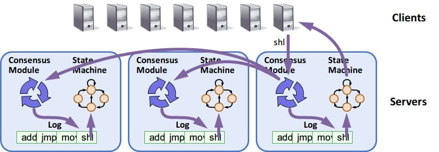
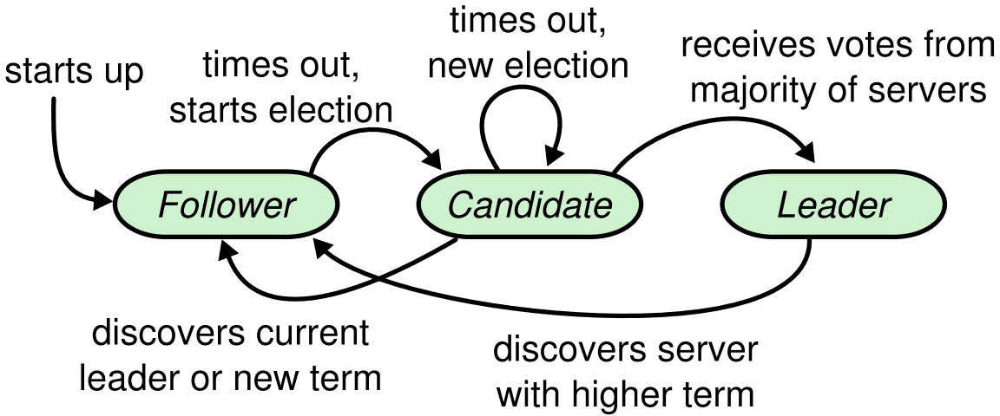

## 前言
Paxos偏向于理论、对如何应用到工程实践提及较少。理解的难度加上现实的骨感，在生产环境中基于Paxos实现一个正确的分布式系统非常难。

Raft在2013年提出，提出的时间虽然不长，但已经有很多系统基于Raft实现。相比Paxos，Raft的买点就是更利于理解、更易于实行。

Raft官网：https://raft.github.io/

为达到更容易理解和实行的目的，Raft将问题分解和具体化：
- Leader统一处理变更操作请求
- 一致性协议的作用具化为保证节点间操作日志副本(log replication)一致
- 以term作为逻辑时钟(logical clock)保证时序
- 节点运行相同状态机(state machine)得到一致结果。

## 简介
分布式存储系统通常通过维护多个副本来提高系统的availability，带来的代价就是分布式存储系统的核心问题之一：维护多个副本的一致性。

Raft协议基于复制状态机（replicated state machine），即一组server从相同的初始状态起，按相同的顺序执行相同的命令，最终会达到一直的状态，一组server记录相同的操作日志，并以相同的顺序应用到状态机。

- 日志：每台机器保存一份日志，日志来自于客户端的请求，包含一系列的命令
- 状态机：状态机会按顺序执行这些命令
- 一致性模型：分布式环境下，保证多机的日志是一致的，这样回放到状态机中的状态是一致的

Raft有一个明确的场景，就是管理复制日志的一致性。

1. 客户端向服务端发送请求
2. 保证让所有服务端节点本地记录请求执行命令
3. 所有服务端节点在本地状态机执行
4. 响应客户端

## Rate角色
Raft算法将Server划分为3种状态，或者也可以称作角色：

#### Leader
负责Client交互和log复制，同一时刻系统中最多存在1个。

#### Follower
被动响应请求RPC，从不主动发起请求RPC。

#### Candidate
一种临时的角色，只存在于leader的选举阶段，某个节点想要变成leader，那么就发起投票请求，同时自己变成candidate。如果选举成功，则变为leader，否则退回为follower。

#### 状态或者说角色的流转如下：

## Raft中的概念

#### Term
在运行过程中，Raft 算法将运行时间划分成为任意不同长度的任期，该任期就是指Term。

任期用连续的自然数进行表示。每一个任期的开始都是始于一次选举（election）。在某些情况下，选票会被瓜分，有可能没有选出领导人，那么election timeout后，将会开始另一个任期，并且立刻开始下一次选举。

Raft 算法保证在给定的一个任期最多只有一个领导人。

#### 消息类型
- RequestVote：候选人在选举期间发起
- AppendEntries：领导人发起的一种心跳机制，让副本节点复制日志也在该命令中完成
- InstallSnapshot: 领导者使用该RPC来发送快照给太落后的追随者

## Raft的具体运行流程
- 可以先看下这个动画：http://thesecretlivesofdata.com/raft/

当服务器启动的时候，服务器成为follower。

在Raft中有两个超时设置用来控制选举。
- election timeout： 指一个Fllower等待这么长时间后，变为candidate。选举超时时间被随机分配在150ms和300ms之间。
-  heartbeat timeout：指leader向follower发送AppendEntries的时间间隔。

只要follower从leader或者candidate收到有效的RPCs就会保持follower状态。如果follower在一段时间内（该段时间被称为election timeout）没有收到消息，则它会假设当前没有可用的leader，然后开启选举新leader的流程。
#### Leader选举（Leader Election）

1. 当服务器启动的时候，服务器成为follower，term=0。
2. 因为没有Leader，follwer在election timeout时间后，进行开始选举。
3. follower自增当前的term值为1，转变为candidate。
4. candidate发送RequestVote 消息给集群中的其他服务器，请求投票给自己。
5. 收到RequestVote的服务器，在同一term中只会按照先到先得投票给至多一个candidate。且只会投票给log至少和自身一样新的candidate，然后重置自己的election timeout计时。
6. 如果收到大多数的节点的投票，则其转变为leader状态。
7. 然后发送AppendEntries消息给集群中的其他服务器，AppendEntries消息会以heartbeat timeout时间间隔发送。
8. follower相应每个AppendEntries消息给leader,然后重置自己的election timeout计时。
9. 由于某些原因leader挂了，follower在election timeout后没有收到心跳，然后自增当前的term值为2，转变为candidate，开始新的选举。
10. 依次执行4，5，6，7，8。

在6步中还存在另外两种情况：
1. 等待响应时，另一个服务器成为了leader。即收到了leader的合法心跳包（term值等于或大于当前自身term值）。则其转变为follower状态。
2. 一段时间后依然没有胜者，即偶数集群中，同时两个候选人票数相同。Raft中使用随机选举超时时间来解决当票数相同无法确定leader的问题。该种情况下会开启新一轮的选举。

#### 日志复制（Log Replication）
Leader的作用就是接收客户端事务操作请求，并将事务操作中的改变复制给Follwer，保证节点间的一致性。Raft采用同步日志文件，即日志复制方式保证。

日志复制主要作用是用于保证节点的一致性，这阶段所做的操作也是为了保证一致性与高可用性。

1. 当Leader选举出来后便开始负责客户端的请求，所有事务（更新操作）请求都必须经过Leader处理。
2. 在Raft中当接收到客户端的日志（事务请求）后先把该日志追加到本地的Log中，但不提交。
3. 然后在下次心跳中，即AppendEntries消息，把该Entry（事务请求或日志）发送给其他Follower。
4. Follower接收到日志后，然后向Leader发送ACK。
5. 当Leader收到大多数（n/2+1）Follower的ACK信息后，将该日志设置为已提交并追加到本地磁盘中，然后通知客户端。
6. 在下个心跳中，Leader将通知所有的Follower将该日志存储在自己的本地磁盘中。

## Raft的工程应用
Raft算法的论文相比Paxos直观很多，更容易在工程上实现。

可以看到Raft算法的实现已经非常多了，https://raft.github.io/#implementations

#### etcd
etcd目标是构建一个高可用的分布式键值（key-value）数据库，基于 Go 语言实现。

Etcd 主要用途是共享配置和服务发现，实现一致性使用了Raft算法。